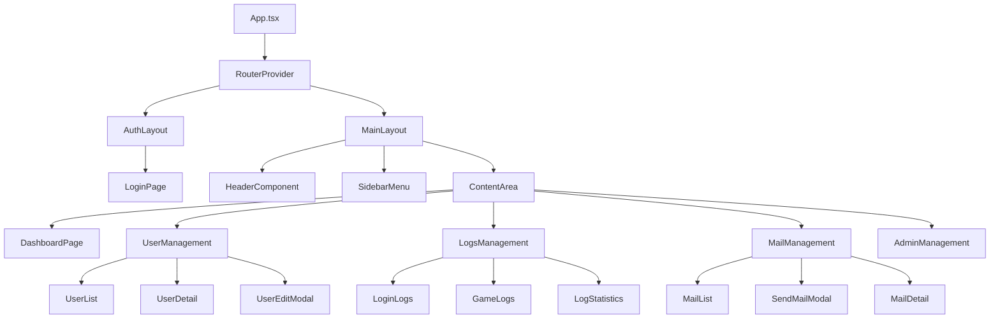

# 游戏管理后台前端设计文档

## 概述

游戏管理后台是一个基于React框架开发的Web管理系统，为游戏运营和管理人员提供统一的管理界面。系统采用现代化的前后端分离架构，通过RESTful API与后端Golang服务进行通信。

**技术栈**：
- 前端框架：React 18+ 
- UI组件库：Ant Design 5.x
- 状态管理：Redux Toolkit + RTK Query
- 路由管理：React Router v6
- HTTP客户端：Axios
- 构建工具：Vite
- 代码规范：ESLint + Prettier
- 类型检查：TypeScript 5.x

**核心功能**：
1. 管理员登录认证
2. 用户信息查询与修改
3. 用户登录对局信息查询
4. 系统邮件发送管理

## 技术栈与依赖

### 核心依赖
```json
{
  "react": "^18.2.0",
  "react-dom": "^18.2.0",
  "react-router-dom": "^6.8.0",
  "antd": "^5.12.0",
  "@reduxjs/toolkit": "^2.0.0",
  "react-redux": "^9.0.0",
  "axios": "^1.6.0",
  "typescript": "^5.0.0",
  "@types/react": "^18.2.0",
  "@types/react-dom": "^18.2.0"
}
```

### 开发依赖
```json
{
  "vite": "^5.0.0",
  "@vitejs/plugin-react": "^4.0.0",
  "eslint": "^8.0.0",
  "prettier": "^3.0.0",
  "@typescript-eslint/eslint-plugin": "^6.0.0",
  "@typescript-eslint/parser": "^6.0.0"
}
```

## 组件架构

### 组件层次结构



### 核心组件定义

#### 1. 布局组件

**AuthLayout** - 认证布局
```typescript
interface AuthLayoutProps {
  children: React.ReactNode;
}

const AuthLayout: React.FC<AuthLayoutProps> = ({ children }) => {
  // 处理未认证状态的布局
  // 包含登录背景、品牌标识等
};
```

**MainLayout** - 主布局
```typescript
interface MainLayoutProps {
  children: React.ReactNode;
}

const MainLayout: React.FC<MainLayoutProps> = ({ children }) => {
  // 包含侧边栏、顶部导航、内容区域
  // 处理已认证状态的布局
};
```

#### 2. 认证组件

**LoginPage** - 登录页面
```typescript
interface LoginFormData {
  username: string;
  password: string;
}

const LoginPage: React.FC = () => {
  const [form] = Form.useForm<LoginFormData>();
  const [loading, setLoading] = useState(false);
  
  const handleLogin = async (values: LoginFormData) => {
    // 调用登录API
    // 处理登录成功/失败逻辑
    // 保存token和用户信息
  };
};
```

#### 3. 用户管理组件

**UserList** - 用户列表
```typescript
interface UserListProps {
  searchParams: UserSearchParams;
  onUserSelect: (userId: number) => void;
}

interface UserSearchParams {
  page: number;
  pageSize: number;
  keyword?: string;
  userid?: number;
}

const UserList: React.FC<UserListProps> = ({ searchParams, onUserSelect }) => {
  // 用户列表展示
  // 分页、搜索、筛选功能
  // 支持点击查看详情
};
```

**UserDetail** - 用户详情
```typescript
interface UserDetailProps {
  userId: number;
  onEdit: () => void;
}

const UserDetail: React.FC<UserDetailProps> = ({ userId, onEdit }) => {
  // 显示用户完整信息
  // 包含基础信息、财富信息、状态信息
  // 提供编辑入口
};
```

**UserEditModal** - 用户编辑模态框
```typescript
interface UserEditModalProps {
  visible: boolean;
  userId: number;
  onCancel: () => void;
  onSuccess: () => void;
}

const UserEditModal: React.FC<UserEditModalProps> = ({
  visible,
  userId,
  onCancel,
  onSuccess
}) => {
  // 用户信息编辑表单
  // 支持修改昵称、状态、财富等
};
```

#### 4. 日志管理组件

**LoginLogs** - 登录日志
```typescript
interface LoginLogsProps {
  userId?: number;
}

const LoginLogs: React.FC<LoginLogsProps> = ({ userId }) => {
  // 展示用户登录历史
  // 支持时间范围筛选
  // 显示登录IP、设备、时长等信息
};
```

**GameLogs** - 对局日志
```typescript
interface GameLogsProps {
  userId?: number;
}

const GameLogs: React.FC<GameLogsProps> = ({ userId }) => {
  // 展示用户对局记录
  // 包含游戏结果、输赢财富等
};
```

#### 5. 邮件管理组件

**MailList** - 邮件列表
```typescript
interface MailListProps {
  onSendMail: () => void;
}

const MailList: React.FC<MailListProps> = ({ onSendMail }) => {
  // 系统邮件列表
  // 支持筛选、搜索
  // 显示邮件状态、类型等
};
```

**SendMailModal** - 发送邮件模态框
```typescript
interface MailFormData {
  type: number;
  title: string;
  content: string;
  awards: AwardItem[];
  startTime: string;
  endTime: string;
  targetUsers: number[];
}

interface AwardItem {
  type: number;
  count: number;
}

const SendMailModal: React.FC<SendMailModalProps> = ({
  visible,
  onCancel,
  onSuccess
}) => {
  // 邮件发送表单
  // 支持全服邮件和个人邮件
  // 奖励配置、时间设置等
};
```

## 路由与导航

### 路由配置

```typescript
const routes = [
  {
    path: '/login',
    element: <AuthLayout><LoginPage /></AuthLayout>
  },
  {
    path: '/',
    element: <MainLayout><Outlet /></MainLayout>,
    children: [
      {
        index: true,
        element: <DashboardPage />
      },
      {
        path: 'users',
        children: [
          {
            index: true,
            element: <UserManagement />
          },
          {
            path: ':userId',
            element: <UserDetail />
          }
        ]
      },
      {
        path: 'logs',
        children: [
          {
            path: 'login',
            element: <LoginLogs />
          },
          {
            path: 'game',
            element: <GameLogs />
          },
          {
            path: 'stats',
            element: <LogStatistics />
          }
        ]
      },
      {
        path: 'mails',
        children: [
          {
            index: true,
            element: <MailManagement />
          },
          {
            path: ':mailId',
            element: <MailDetail />
          }
        ]
      },
      {
        path: 'admin',
        element: <AdminManagement />
      }
    ]
  }
];
```

### 导航菜单结构

```typescript
const menuItems = [
  {
    key: 'dashboard',
    icon: <DashboardOutlined />,
    label: '控制台',
    path: '/'
  },
  {
    key: 'users',
    icon: <UserOutlined />,
    label: '用户管理',
    children: [
      {
        key: 'user-list',
        label: '用户列表',
        path: '/users'
      }
    ]
  },
  {
    key: 'logs',
    icon: <FileTextOutlined />,
    label: '日志查询',
    children: [
      {
        key: 'login-logs',
        label: '登录日志',
        path: '/logs/login'
      },
      {
        key: 'game-logs',
        label: '对局日志',
        path: '/logs/game'
      },
      {
        key: 'log-stats',
        label: '统计分析',
        path: '/logs/stats'
      }
    ]
  },
  {
    key: 'mails',
    icon: <MailOutlined />,
    label: '邮件管理',
    path: '/mails'
  },
  {
    key: 'admin',
    icon: <SettingOutlined />,
    label: '管理员',
    path: '/admin'
  }
];
```

## 样式策略

### 主题配置

使用Ant Design主题定制功能，配置符合游戏管理后台风格的主题：

```typescript
const themeConfig = {
  token: {
    colorPrimary: '#1890ff',
    colorSuccess: '#52c41a',
    colorWarning: '#faad14',
    colorError: '#f5222d',
    colorInfo: '#1890ff',
    borderRadius: 6,
    wireframe: false,
  },
  components: {
    Layout: {
      headerBg: '#001529',
      siderBg: '#001529',
    },
    Menu: {
      darkItemBg: '#001529',
      darkItemSelectedBg: '#1890ff',
    }
  }
};
```

### CSS组织策略

采用CSS Modules + Less的组合：

```less
// styles/variables.less
@primary-color: #1890ff;
@text-color: rgba(0, 0, 0, 0.85);
@border-color: #d9d9d9;
@border-radius: 6px;

// 布局相关
@header-height: 64px;
@sidebar-width: 256px;
@sidebar-collapsed-width: 80px;

// components/UserList/UserList.module.less
.userList {
  padding: 24px;
  
  .searchForm {
    margin-bottom: 16px;
    padding: 16px;
    background: #fafafa;
    border-radius: @border-radius;
  }
  
  .table {
    .statusTag {
      &.active {
        color: @primary-color;
        background: #e6f7ff;
        border-color: @primary-color;
      }
      
      &.inactive {
        color: #999;
        background: #f5f5f5;
        border-color: #d9d9d9;
      }
    }
  }
}
```

### 响应式设计

```less
// 断点定义
@screen-xs: 480px;
@screen-sm: 576px;
@screen-md: 768px;
@screen-lg: 992px;
@screen-xl: 1200px;
@screen-xxl: 1600px;

// 响应式布局
.mainLayout {
  @media (max-width: @screen-md) {
    .sidebar {
      position: fixed;
      z-index: 1000;
      transform: translateX(-100%);
      transition: transform 0.3s ease;
      
      &.visible {
        transform: translateX(0);
      }
    }
    
    .content {
      margin-left: 0;
    }
  }
}
```

## 状态管理

### Redux Store结构

```typescript
interface RootState {
  auth: AuthState;
  user: UserState;
  logs: LogsState;
  mail: MailState;
  ui: UIState;
}

// 认证状态
interface AuthState {
  isAuthenticated: boolean;
  token: string | null;
  adminInfo: AdminInfo | null;
  loading: boolean;
}

// 用户管理状态
interface UserState {
  userList: UserInfo[];
  currentUser: UserInfo | null;
  pagination: PaginationState;
  searchParams: UserSearchParams;
  loading: boolean;
}

// 日志状态
interface LogsState {
  loginLogs: LoginLogItem[];
  gameLogs: GameLogItem[];
  loginStats: LoginStats | null;
  gameStats: GameStats | null;
  loading: boolean;
}

// 邮件状态
interface MailState {
  mailList: MailItem[];
  currentMail: MailItem | null;
  mailStats: MailStats | null;
  loading: boolean;
}

// UI状态
interface UIState {
  sidebarCollapsed: boolean;
  theme: 'light' | 'dark';
  language: 'zh' | 'en';
}
```

### Redux Toolkit配置

```typescript
// store/slices/authSlice.ts
const authSlice = createSlice({
  name: 'auth',
  initialState: {
    isAuthenticated: false,
    token: null,
    adminInfo: null,
    loading: false
  },
  reducers: {
    loginStart: (state) => {
      state.loading = true;
    },
    loginSuccess: (state, action) => {
      state.isAuthenticated = true;
      state.token = action.payload.token;
      state.adminInfo = action.payload.adminInfo;
      state.loading = false;
    },
    loginFailure: (state) => {
      state.loading = false;
    },
    logout: (state) => {
      state.isAuthenticated = false;
      state.token = null;
      state.adminInfo = null;
    }
  }
});

// store/api/adminApi.ts (RTK Query)
export const adminApi = createApi({
  reducerPath: 'adminApi',
  baseQuery: fetchBaseQuery({
    baseUrl: '/api/admin/',
    prepareHeaders: (headers, { getState }) => {
      const token = (getState() as RootState).auth.token;
      if (token) {
        headers.set('authorization', `Bearer ${token}`);
      }
      return headers;
    },
  }),
  tagTypes: ['User', 'Mail', 'Logs'],
  endpoints: (builder) => ({
    login: builder.mutation<LoginResponse, LoginRequest>({
      query: (credentials) => ({
        url: 'login',
        method: 'POST',
        body: credentials,
      }),
    }),
    getUserList: builder.query<UserListResponse, UserListRequest>({
      query: (params) => ({
        url: 'users',
        params,
      }),
      providesTags: ['User'],
    }),
    updateUser: builder.mutation<void, UpdateUserRequest>({
      query: ({ userId, ...body }) => ({
        url: `users/${userId}`,
        method: 'PUT',
        body,
      }),
      invalidatesTags: ['User'],
    }),
  }),
});
```

## API集成层

### HTTP客户端配置

```typescript
// utils/httpClient.ts
import axios, { AxiosResponse, AxiosError } from 'axios';
import { message } from 'antd';

const httpClient = axios.create({
  baseURL: process.env.REACT_APP_API_BASE_URL || 'http://localhost:8080/api',
  timeout: 10000,
  headers: {
    'Content-Type': 'application/json',
  },
});

// 请求拦截器
httpClient.interceptors.request.use(
  (config) => {
    const token = localStorage.getItem('adminToken');
    if (token) {
      config.headers.Authorization = `Bearer ${token}`;
    }
    return config;
  },
  (error) => Promise.reject(error)
);

// 响应拦截器
httpClient.interceptors.response.use(
  (response: AxiosResponse) => {
    const { code, message: msg, data } = response.data;
    
    if (code === 200) {
      return { ...response, data };
    } else {
      message.error(msg || '请求失败');
      return Promise.reject(new Error(msg || '请求失败'));
    }
  },
  (error: AxiosError) => {
    if (error.response?.status === 401) {
      // 处理未授权，跳转到登录页
      localStorage.removeItem('adminToken');
      window.location.href = '/login';
    } else if (error.response?.status >= 500) {
      message.error('服务器错误，请稍后重试');
    } else {
      message.error(error.message || '网络错误');
    }
    return Promise.reject(error);
  }
);
```

### API服务层

```typescript
// services/adminService.ts
interface LoginParams {
  username: string;
  password: string;
}

interface LoginResponse {
  token: string;
  adminInfo: AdminInfo;
}

export const adminService = {
  // 管理员认证
  login: (params: LoginParams): Promise<LoginResponse> =>
    httpClient.post('/admin/login', params),
    
  logout: (): Promise<void> =>
    httpClient.post('/admin/logout'),
    
  getAdminInfo: (): Promise<AdminInfo> =>
    httpClient.get('/admin/info'),
};

// services/userService.ts
export const userService = {
  // 用户管理
  getUserList: (params: UserListRequest): Promise<UserListResponse> =>
    httpClient.get('/admin/users', { params }),
    
  getUserDetail: (userId: number): Promise<UserInfo> =>
    httpClient.get(`/admin/users/${userId}`),
    
  updateUser: (userId: number, data: UserUpdateRequest): Promise<void> =>
    httpClient.put(`/admin/users/${userId}`, data),
};

// services/logService.ts
export const logService = {
  // 日志查询
  getLoginLogs: (params: LogQueryParams): Promise<LoginLogsResponse> =>
    httpClient.get('/admin/logs/auth', { params }),
    
  getGameLogs: (params: LogQueryParams): Promise<GameLogsResponse> =>
    httpClient.get('/admin/logs/game', { params }),
    
  getLoginStats: (userId?: number): Promise<LoginStats> =>
    httpClient.get('/admin/logs/login-stats', { params: { userid: userId } }),
    
  getGameStats: (userId?: number): Promise<GameStats> =>
    httpClient.get('/admin/logs/game-stats', { params: { userid: userId } }),
};

// services/mailService.ts
export const mailService = {
  // 邮件管理
  sendMail: (data: SendMailRequest): Promise<void> =>
    httpClient.post('/admin/mails/send', data),
    
  getMailList: (params: MailListRequest): Promise<MailListResponse> =>
    httpClient.get('/admin/mails', { params }),
    
  getMailDetail: (mailId: number): Promise<MailItem> =>
    httpClient.get(`/admin/mails/${mailId}`),
    
  updateMailStatus: (mailId: number, status: number): Promise<void> =>
    httpClient.put(`/admin/mails/${mailId}/status`, { status }),
    
  getMailStats: (): Promise<MailStats> =>
    httpClient.get('/admin/mails/stats'),
};
```

### 类型定义

```typescript
// types/api.ts
export interface BaseResponse<T = any> {
  code: number;
  message: string;
  data: T;
}

export interface PaginationParams {
  page: number;
  pageSize: number;
}

export interface PaginationResponse<T> {
  total: number;
  page: number;
  pageSize: number;
  data: T[];
}

// 用户相关类型
export interface UserInfo {
  userid: number;
  nickname: string;
  headurl: string;
  sex: number;
  province: string;
  city: string;
  ip: string;
  status: number;
  gameid: number;
  roomid: number;
  riches: UserRich[];
  createTime: string;
  updateTime: string;
}

export interface UserRich {
  richType: number;
  richNums: number;
}

export interface UserListRequest extends PaginationParams {
  keyword?: string;
  userid?: number;
}

export interface UserListResponse {
  total: number;
  users: UserInfo[];
}

export interface UserUpdateRequest {
  nickname?: string;
  status?: number;
  riches?: UserRich[];
}

// 日志相关类型
export interface LoginLogItem {
  id: number;
  userid: number;
  channel: string;
  ip: string;
  deviceId: string;
  loginTime: string;
  logoutTime: string;
  duration: number;
  status: number;
}

export interface GameLogItem {
  id: number;
  userid: number;
  gameid: number;
  roomid: number;
  gameMode: number;
  result: number;
  score: number;
  winRiches: number;
  loseRiches: number;
  startTime: string;
  endTime: string;
  createTime: string;
}

export interface LogQueryParams extends PaginationParams {
  userid?: number;
  startTime?: string;
  endTime?: string;
}

export interface LoginStats {
  totalLogins: number;
  lastLoginTime: string;
  todayLogins: number;
  weekLogins: number;
  avgDuration: number;
}

export interface GameStats {
  totalGames: number;
  winRate: number;
  totalWinRiches: number;
  totalLoseRiches: number;
  avgScore: number;
}

// 邮件相关类型
export interface MailItem {
  id: number;
  type: number;
  title: string;
  content: string;
  awards: string;
  startTime: string;
  endTime: string;
  status: number;
}

export interface SendMailRequest {
  type: number;
  title: string;
  content: string;
  awards: string;
  startTime: string;
  endTime: string;
  targetUsers?: number[];
}

export interface MailListRequest extends PaginationParams {
  status?: number;
  type?: number;
}

export interface MailListResponse {
  total: number;
  mails: MailItem[];
}

export interface MailStats {
  totalMails: number;
  activeMails: number;
  sentToday: number;
  pendingMails: number;
}
```

## 测试策略

### 单元测试

使用Jest + React Testing Library进行组件测试：

```typescript
// __tests__/components/UserList.test.tsx
import { render, screen, waitFor } from '@testing-library/react';
import userEvent from '@testing-library/user-event';
import { Provider } from 'react-redux';
import { BrowserRouter } from 'react-router-dom';
import { store } from '../store';
import UserList from '../components/UserList';

const renderWithProviders = (component: React.ReactElement) => {
  return render(
    <Provider store={store}>
      <BrowserRouter>
        {component}
      </BrowserRouter>
    </Provider>
  );
};

describe('UserList Component', () => {
  beforeEach(() => {
    // Mock API响应
    jest.spyOn(userService, 'getUserList').mockResolvedValue({
      total: 100,
      users: [
        {
          userid: 12345,
          nickname: '测试用户',
          status: 1,
          // ... 其他属性
        }
      ]
    });
  });

  test('renders user list correctly', async () => {
    renderWithProviders(<UserList />);
    
    // 验证表格渲染
    expect(screen.getByText('用户ID')).toBeInTheDocument();
    expect(screen.getByText('昵称')).toBeInTheDocument();
    
    // 等待数据加载
    await waitFor(() => {
      expect(screen.getByText('测试用户')).toBeInTheDocument();
    });
  });

  test('handles search functionality', async () => {
    const user = userEvent.setup();
    renderWithProviders(<UserList />);
    
    // 输入搜索关键词
    const searchInput = screen.getByPlaceholderText('请输入用户昵称');
    await user.type(searchInput, '测试');
    
    // 点击搜索按钮
    const searchButton = screen.getByText('搜索');
    await user.click(searchButton);
    
    // 验证API调用
    expect(userService.getUserList).toHaveBeenCalledWith({
      page: 1,
      pageSize: 20,
      keyword: '测试'
    });
  });
});
```

### 集成测试

```typescript
// __tests__/integration/UserManagement.test.tsx
describe('User Management Integration', () => {
  test('complete user edit flow', async () => {
    const user = userEvent.setup();
    renderWithProviders(<UserManagement />);
    
    // 1. 加载用户列表
    await waitFor(() => {
      expect(screen.getByText('测试用户')).toBeInTheDocument();
    });
    
    // 2. 点击编辑按钮
    const editButton = screen.getByText('编辑');
    await user.click(editButton);
    
    // 3. 修改用户信息
    const nicknameInput = screen.getByLabelText('昵称');
    await user.clear(nicknameInput);
    await user.type(nicknameInput, '新昵称');
    
    // 4. 提交修改
    const submitButton = screen.getByText('确定');
    await user.click(submitButton);
    
    // 5. 验证成功消息
    await waitFor(() => {
      expect(screen.getByText('修改成功')).toBeInTheDocument();
    });
  });
});
```

### API Mock

```typescript
// __tests__/mocks/handlers.ts
import { rest } from 'msw';

export const handlers = [
  // 管理员登录
  rest.post('/api/admin/login', (req, res, ctx) => {
    return res(
      ctx.json({
        code: 200,
        message: '登录成功',
        data: {
          token: 'mock-jwt-token',
          adminInfo: {
            id: 1,
            username: 'admin',
            email: 'admin@example.com',
            realName: '系统管理员',
            isSuperAdmin: true,
            lastLoginTime: '2024-01-01T12:00:00Z'
          }
        }
      })
    );
  }),
  
  // 用户列表
  rest.get('/api/admin/users', (req, res, ctx) => {
    return res(
      ctx.json({
        code: 200,
        message: '获取成功',
        data: {
          total: 100,
          users: [
            {
              userid: 12345,
              nickname: '测试用户',
              headurl: 'https://example.com/avatar.jpg',
              sex: 1,
              province: '广东省',
              city: '深圳市',
              ip: '192.168.1.1',
              status: 1,
              gameid: 0,
              roomid: 0,
              riches: [
                { richType: 1, richNums: 10000 },
                { richType: 2, richNums: 500 }
              ],
              createTime: '2024-01-01T12:00:00Z',
              updateTime: '2024-01-01T12:00:00Z'
            }
          ]
        }
      })
    );
  }),
];
```

## 项目结构

### 目录组织

```
game-admin-dashboard/
├── public/
│   ├── index.html
│   ├── favicon.ico
│   └── manifest.json
├── src/
│   ├── components/           # 通用组件
│   │   ├── Layout/
│   │   │   ├── AuthLayout/
│   │   │   │   ├── index.tsx
│   │   │   │   └── AuthLayout.module.less
│   │   │   └── MainLayout/
│   │   │       ├── index.tsx
│   │   │       ├── HeaderComponent/
│   │   │       ├── SidebarMenu/
│   │   │       └── MainLayout.module.less
│   │   ├── Common/           # 通用UI组件
│   │   │   ├── LoadingSpinner/
│   │   │   ├── ConfirmDialog/
│   │   │   ├── SearchForm/
│   │   │   └── DataTable/
│   │   └── Business/         # 业务组件
│   │       ├── UserComponents/
│   │       │   ├── UserList/
│   │       │   ├── UserDetail/
│   │       │   └── UserEditModal/
│   │       ├── LogComponents/
│   │       │   ├── LoginLogs/
│   │       │   ├── GameLogs/
│   │       │   └── LogStatistics/
│   │       └── MailComponents/
│   │           ├── MailList/
│   │           ├── SendMailModal/
│   │           └── MailDetail/
│   ├── pages/               # 页面组件
│   │   ├── Login/
│   │   │   ├── index.tsx
│   │   │   └── Login.module.less
│   │   ├── Dashboard/
│   │   ├── UserManagement/
│   │   ├── LogsManagement/
│   │   ├── MailManagement/
│   │   └── AdminManagement/
│   ├── store/               # 状态管理
│   │   ├── index.ts
│   │   ├── slices/
│   │   │   ├── authSlice.ts
│   │   │   ├── userSlice.ts
│   │   │   ├── logSlice.ts
│   │   │   ├── mailSlice.ts
│   │   │   └── uiSlice.ts
│   │   └── api/
│   │       ├── adminApi.ts
│   │       ├── userApi.ts
│   │       ├── logApi.ts
│   │       └── mailApi.ts
│   ├── services/            # API服务层
│   │   ├── httpClient.ts
│   │   ├── adminService.ts
│   │   ├── userService.ts
│   │   ├── logService.ts
│   │   └── mailService.ts
│   ├── utils/               # 工具函数
│   │   ├── formatters.ts    # 数据格式化
│   │   ├── validators.ts    # 表单验证
│   │   ├── constants.ts     # 常量定义
│   │   ├── helpers.ts       # 通用助手函数
│   │   └── dateUtils.ts     # 日期处理
│   ├── hooks/               # 自定义Hooks
│   │   ├── useAuth.ts
│   │   ├── usePermission.ts
│   │   ├── useTable.ts
│   │   └── useLocalStorage.ts
│   ├── types/               # TypeScript类型定义
│   │   ├── api.ts
│   │   ├── user.ts
│   │   ├── log.ts
│   │   ├── mail.ts
│   │   └── common.ts
│   ├── styles/              # 样式文件
│   │   ├── variables.less   # Less变量
│   │   ├── mixins.less      # Less混入
│   │   ├── global.less      # 全局样式
│   │   └── themes/          # 主题配置
│   │       ├── light.ts
│   │       └── dark.ts
│   ├── assets/              # 静态资源
│   │   ├── images/
│   │   ├── icons/
│   │   └── fonts/
│   ├── locales/             # 国际化文件
│   │   ├── zh.json
│   │   └── en.json
│   ├── App.tsx              # 根组件
│   ├── App.module.less
│   ├── main.tsx             # 应用入口
│   └── vite-env.d.ts
├── __tests__/               # 测试文件
│   ├── components/
│   ├── pages/
│   ├── services/
│   ├── utils/
│   ├── integration/
│   ├── mocks/
│   │   ├── handlers.ts
│   │   └── server.ts
│   └── setup.ts
├── docs/                    # 项目文档
│   ├── API.md
│   ├── DEPLOYMENT.md
│   └── DEVELOPMENT.md
├── .env.example             # 环境变量模板
├── .env.development         # 开发环境变量
├── .env.production          # 生产环境变量
├── .gitignore
├── .eslintrc.js
├── .prettierrc
├── tsconfig.json
├── vite.config.ts
├── package.json
└── README.md
```

### 组件文件结构规范

每个组件目录应包含：
- `index.tsx` - 组件主文件
- `ComponentName.module.less` - 样式文件
- `types.ts` - 组件相关类型定义（如需要）
- `hooks.ts` - 组件专用hooks（如需要）
- `constants.ts` - 组件常量（如需要）

## 环境配置

### 开发环境要求

- **Node.js**: >= 18.0.0 (建议使用最新LTS版本)
- **npm**: >= 8.0.0 或 **yarn**: >= 1.22.0
- **TypeScript**: >= 5.0.0

### 环境变量配置

```bash
# .env.development
VITE_APP_TITLE=游戏管理后台
VITE_API_BASE_URL=http://localhost:8080/api
VITE_WS_URL=ws://localhost:8080/ws
VITE_ENABLE_MOCK=false
VITE_LOG_LEVEL=debug

# .env.production
VITE_APP_TITLE=游戏管理后台
VITE_API_BASE_URL=https://api.yourdomain.com/api
VITE_WS_URL=wss://api.yourdomain.com/ws
VITE_ENABLE_MOCK=false
VITE_LOG_LEVEL=error

# .env.test
VITE_APP_TITLE=游戏管理后台测试
VITE_API_BASE_URL=http://localhost:3001/api
VITE_ENABLE_MOCK=true
VITE_LOG_LEVEL=warn
```

### Vite配置

```typescript
// vite.config.ts
import { defineConfig } from 'vite';
import react from '@vitejs/plugin-react';
import { resolve } from 'path';

export default defineConfig({
  plugins: [react()],
  resolve: {
    alias: {
      '@': resolve(__dirname, 'src'),
      '@components': resolve(__dirname, 'src/components'),
      '@pages': resolve(__dirname, 'src/pages'),
      '@services': resolve(__dirname, 'src/services'),
      '@utils': resolve(__dirname, 'src/utils'),
      '@store': resolve(__dirname, 'src/store'),
      '@types': resolve(__dirname, 'src/types'),
      '@styles': resolve(__dirname, 'src/styles'),
      '@assets': resolve(__dirname, 'src/assets'),
    },
  },
  css: {
    preprocessorOptions: {
      less: {
        additionalData: '@import "@styles/variables.less";',
        javascriptEnabled: true,
      },
    },
    modules: {
      localsConvention: 'camelCase',
    },
  },
  server: {
    port: 3000,
    proxy: {
      '/api': {
        target: 'http://localhost:8080',
        changeOrigin: true,
        secure: false,
      },
    },
  },
  build: {
    outDir: 'dist',
    sourcemap: false,
    rollupOptions: {
      output: {
        chunkFileNames: 'js/[name]-[hash].js',
        entryFileNames: 'js/[name]-[hash].js',
        assetFileNames: '[ext]/[name]-[hash].[ext]',
        manualChunks: {
          vendor: ['react', 'react-dom', 'react-router-dom'],
          antd: ['antd'],
          redux: ['@reduxjs/toolkit', 'react-redux'],
        },
      },
    },
  },
});
```

## 构建与部署

### 开发命令

```json
{
  "scripts": {
    "dev": "vite",
    "build": "vite build",
    "build:test": "vite build --mode test",
    "preview": "vite preview",
    "test": "jest",
    "test:watch": "jest --watch",
    "test:coverage": "jest --coverage",
    "lint": "eslint src --ext .ts,.tsx",
    "lint:fix": "eslint src --ext .ts,.tsx --fix",
    "format": "prettier --write src/**/*.{ts,tsx,less,json}",
    "type-check": "tsc --noEmit",
    "analyze": "npm run build && npx vite-bundle-analyzer dist"
  }
}
```

### Docker部署

```dockerfile
# Dockerfile
FROM node:18-alpine AS builder

WORKDIR /app
COPY package*.json ./
RUN npm ci --only=production

COPY . .
RUN npm run build

# 生产环境
FROM nginx:alpine

COPY --from=builder /app/dist /usr/share/nginx/html
COPY nginx.conf /etc/nginx/nginx.conf

EXPOSE 80

CMD ["nginx", "-g", "daemon off;"]
```

```nginx
# nginx.conf
user nginx;
worker_processes auto;

events {
    worker_connections 1024;
}

http {
    include /etc/nginx/mime.types;
    default_type application/octet-stream;
    
    sendfile on;
    keepalive_timeout 65;
    
    # Gzip压缩
    gzip on;
    gzip_vary on;
    gzip_min_length 1024;
    gzip_types
        application/javascript
        application/json
        text/css
        text/javascript
        text/xml
        text/plain;
    
    server {
        listen 80;
        server_name localhost;
        
        root /usr/share/nginx/html;
        index index.html;
        
        # 处理SPA路由
        location / {
            try_files $uri $uri/ /index.html;
        }
        
        # API代理
        location /api/ {
            proxy_pass http://backend:8080;
            proxy_set_header Host $host;
            proxy_set_header X-Real-IP $remote_addr;
            proxy_set_header X-Forwarded-For $proxy_add_x_forwarded_for;
            proxy_set_header X-Forwarded-Proto $scheme;
        }
        
        # 静态资源缓存
        location ~* \.(js|css|png|jpg|jpeg|gif|ico|svg)$ {
            expires 1y;
            add_header Cache-Control "public, immutable";
        }
    }
}
```

### CI/CD Pipeline

```yaml
# .github/workflows/deploy.yml
name: Deploy Game Admin Dashboard

on:
  push:
    branches: [main, develop]
  pull_request:
    branches: [main]

jobs:
  test:
    runs-on: ubuntu-latest
    steps:
      - uses: actions/checkout@v3
      
      - name: Setup Node.js
        uses: actions/setup-node@v3
        with:
          node-version: '18'
          cache: 'npm'
      
      - name: Install dependencies
        run: npm ci
      
      - name: Run type check
        run: npm run type-check
      
      - name: Run linting
        run: npm run lint
      
      - name: Run tests
        run: npm run test:coverage
      
      - name: Upload coverage
        uses: codecov/codecov-action@v3
        
  build:
    needs: test
    runs-on: ubuntu-latest
    if: github.ref == 'refs/heads/main'
    
    steps:
      - uses: actions/checkout@v3
      
      - name: Setup Node.js
        uses: actions/setup-node@v3
        with:
          node-version: '18'
          cache: 'npm'
      
      - name: Install dependencies
        run: npm ci
      
      - name: Build application
        run: npm run build
        env:
          VITE_API_BASE_URL: ${{ secrets.API_BASE_URL }}
      
      - name: Build Docker image
        run: |
          docker build -t game-admin-dashboard:${{ github.sha }} .
          docker tag game-admin-dashboard:${{ github.sha }} game-admin-dashboard:latest
      
      - name: Deploy to server
        run: |
          # 部署脚本
          echo "Deploy to production server"
```

## 开发规范

### 代码规范

#### ESLint配置

```javascript
// .eslintrc.js
module.exports = {
  env: {
    browser: true,
    es2021: true,
    jest: true,
  },
  extends: [
    'eslint:recommended',
    '@typescript-eslint/recommended',
    'plugin:react/recommended',
    'plugin:react-hooks/recommended',
    'plugin:jsx-a11y/recommended',
  ],
  parser: '@typescript-eslint/parser',
  parserOptions: {
    ecmaFeatures: {
      jsx: true,
    },
    ecmaVersion: 'latest',
    sourceType: 'module',
  },
  plugins: [
    'react',
    '@typescript-eslint',
    'jsx-a11y',
  ],
  rules: {
    // React规则
    'react/react-in-jsx-scope': 'off',
    'react/prop-types': 'off',
    'react/jsx-uses-react': 'off',
    
    // TypeScript规则
    '@typescript-eslint/no-unused-vars': 'error',
    '@typescript-eslint/explicit-function-return-type': 'off',
    '@typescript-eslint/no-explicit-any': 'warn',
    
    // 通用规则
    'prefer-const': 'error',
    'no-var': 'error',
    'no-console': 'warn',
    'no-debugger': 'error',
    
    // 命名规范
    'camelcase': ['error', { properties: 'never' }],
  },
  settings: {
    react: {
      version: 'detect',
    },
  },
};
```

#### Prettier配置

```json
{
  "semi": true,
  "trailingComma": "es5",
  "singleQuote": true,
  "printWidth": 80,
  "tabWidth": 2,
  "useTabs": false,
  "bracketSpacing": true,
  "jsxBracketSameLine": false,
  "arrowParens": "avoid",
  "endOfLine": "lf"
}
```

### 命名规范

#### 文件命名
- 组件文件：使用PascalCase，如 `UserList.tsx`
- 工具函数文件：使用camelCase，如 `formatUtils.ts`
- 常量文件：使用camelCase，如 `apiConstants.ts`
- 样式文件：使用kebab-case，如 `user-list.module.less`

#### 变量命名
- 变量和函数：使用camelCase，如 `userData`, `getUserInfo`
- 常量：使用SCREAMING_SNAKE_CASE，如 `API_BASE_URL`
- 组件Props接口：使用PascalCase + Props后缀，如 `UserListProps`
- API响应接口：使用PascalCase + Response后缀，如 `UserListResponse`

#### 组件命名
- 页面组件：使用PascalCase + Page后缀，如 `UserManagementPage`
- 业务组件：使用PascalCase，描述功能，如 `UserEditModal`
- 通用组件：使用PascalCase，如 `DataTable`, `SearchForm`

### Git提交规范

采用Conventional Commits规范：

```
<type>[optional scope]: <description>

[optional body]

[optional footer(s)]
```

类型说明：
- `feat`: 新功能
- `fix`: 修复bug
- `docs`: 文档更新
- `style`: 代码格式调整
- `refactor`: 重构代码
- `test`: 添加或修改测试
- `chore`: 构建工具或辅助工具的变动

示例：
```
feat(user): add user search functionality

Implement user search with keyword and userid filters.
Add debounce to search input for better performance.

Closes #123
```

## 性能优化

### 代码分割

```typescript
// 路由级别的代码分割
const UserManagementPage = lazy(() => import('@pages/UserManagement'));
const LogsManagementPage = lazy(() => import('@pages/LogsManagement'));
const MailManagementPage = lazy(() => import('@pages/MailManagement'));

// 在路由配置中使用Suspense
const routes = [
  {
    path: '/users',
    element: (
      <Suspense fallback={<LoadingSpinner />}>
        <UserManagementPage />
      </Suspense>
    )
  }
];
```

### 组件优化

```typescript
// 使用React.memo优化组件重渲染
const UserListItem = React.memo<UserListItemProps>(({ user, onEdit }) => {
  return (
    <div className={styles.userItem}>
      {/* 组件内容 */}
    </div>
  );
});

// 使用useMemo优化计算密集型操作
const UserList: React.FC<UserListProps> = ({ users, searchKeyword }) => {
  const filteredUsers = useMemo(() => {
    if (!searchKeyword) return users;
    return users.filter(user => 
      user.nickname.toLowerCase().includes(searchKeyword.toLowerCase())
    );
  }, [users, searchKeyword]);
  
  return (
    <div>
      {filteredUsers.map(user => (
        <UserListItem key={user.userid} user={user} />
      ))}
    </div>
  );
};

// 使用useCallback优化函数传递
const UserManagement: React.FC = () => {
  const [selectedUser, setSelectedUser] = useState<number | null>(null);
  
  const handleUserSelect = useCallback((userId: number) => {
    setSelectedUser(userId);
  }, []);
  
  return (
    <UserList onUserSelect={handleUserSelect} />
  );
};
```

### 状态管理优化

```typescript
// 使用RTK Query的缓存机制
export const userApi = createApi({
  reducerPath: 'userApi',
  baseQuery: fetchBaseQuery({ baseUrl: '/api/admin/users' }),
  tagTypes: ['User'],
  endpoints: (builder) => ({
    getUserList: builder.query<UserListResponse, UserListRequest>({
      query: (params) => ({ url: '', params }),
      providesTags: (result) =>
        result
          ? [
              ...result.users.map(({ userid }) => ({ type: 'User' as const, id: userid })),
              { type: 'User', id: 'LIST' },
            ]
          : [{ type: 'User', id: 'LIST' }],
      // 缓存5分钟
      keepUnusedDataFor: 300,
    }),
    updateUser: builder.mutation<void, UpdateUserRequest>({
      query: ({ userId, ...body }) => ({
        url: `/${userId}`,
        method: 'PUT',
        body,
      }),
      invalidatesTags: (result, error, { userId }) => [
        { type: 'User', id: userId },
        { type: 'User', id: 'LIST' },
      ],
    }),
  }),
});
```

## 安全考虑

### 双重认证系统架构

后端项目采用了双重认证系统设计，为不同的客户端提供独立的认证机制：

#### 1. 客户端认证系统（游戏客户端）
- **中间件**：`AuthMiddlewareByJWT()`
- **JWT密钥**：`config.JWT.SecretKey`
- **适用范围**：游戏客户端API（如邮件查看、奖励领取等）
- **认证复杂度**：DES+Redis复杂验证机制

#### 2. 管理后台认证系统（管理员专用）
- **中间件**：`AdminJWTMiddleware()`
- **JWT密钥**：`config.Admin.JWTSecretKey`
- **适用范围**：管理后台API（用户管理、日志查询、邮件管理等）
- **认证特性**：
  - 简化的JWT认证机制
  - Redis会话验证
  - IP地址变更检测
  - 超级管理员权限控制

### 管理后台认证实现

```typescript
// 管理员Token管理器
class AdminTokenManager {
  private static readonly ADMIN_TOKEN_KEY = 'adminToken';
  private static readonly ADMIN_REFRESH_TOKEN_KEY = 'adminRefreshToken';
  
  static setAdminToken(token: string): void {
    // 存储管理员专用token
    localStorage.setItem(this.ADMIN_TOKEN_KEY, token);
  }
  
  static getAdminToken(): string | null {
    return localStorage.getItem(this.ADMIN_TOKEN_KEY);
  }
  
  static removeAdminToken(): void {
    localStorage.removeItem(this.ADMIN_TOKEN_KEY);
    localStorage.removeItem(this.ADMIN_REFRESH_TOKEN_KEY);
  }
  
  static isAdminTokenExpired(token: string): boolean {
    try {
      const payload = JSON.parse(atob(token.split('.')[1]));
      // 管理员token有效期为8小时（config.Admin.token_expire_hours）
      return payload.exp * 1000 < Date.now();
    } catch {
      return true;
    }
  }
  
  // 解析管理员信息
  static parseAdminInfo(token: string): AdminTokenPayload | null {
    try {
      const payload = JSON.parse(atob(token.split('.')[1]));
      return {
        adminId: payload.adminId,
        username: payload.username,
        email: payload.email,
        realName: payload.realName,
        isSuperAdmin: payload.isSuperAdmin,
        departmentId: payload.departmentId,
        loginIp: payload.loginIp
      };
    } catch {
      return null;
    }
  }
}

// 管理员Token载荷类型
interface AdminTokenPayload {
  adminId: number;
  username: string;
  email: string;
  realName: string;
  isSuperAdmin: boolean;
  departmentId?: number;
  loginIp: string;
}
```

### HTTP客户端认证配置

```typescript
// utils/adminHttpClient.ts
import axios, { AxiosResponse, AxiosError } from 'axios';
import { message } from 'antd';
import { AdminTokenManager } from './adminTokenManager';

const adminHttpClient = axios.create({
  baseURL: process.env.REACT_APP_API_BASE_URL || 'http://localhost:8080/api',
  timeout: 10000,
  headers: {
    'Content-Type': 'application/json',
  },
});

// 请求拦截器 - 添加管理员JWT Token
adminHttpClient.interceptors.request.use(
  (config) => {
    const adminToken = AdminTokenManager.getAdminToken();
    if (adminToken) {
      // 使用Bearer认证方式，对应后端AdminJWTMiddleware
      config.headers.Authorization = `Bearer ${adminToken}`;
    }
    return config;
  },
  (error) => Promise.reject(error)
);

// 响应拦截器 - 处理管理员认证失败
adminHttpClient.interceptors.response.use(
  (response: AxiosResponse) => {
    const { code, message: msg, data } = response.data;
    
    if (code === 200) {
      return { ...response, data };
    } else {
      message.error(msg || '请求失败');
      return Promise.reject(new Error(msg || '请求失败'));
    }
  },
  (error: AxiosError) => {
    if (error.response?.status === 401) {
      // 管理员认证失败，清除token并跳转到登录页
      AdminTokenManager.removeAdminToken();
      message.error('登录已过期，请重新登录');
      window.location.href = '/login';
    } else if (error.response?.status === 403) {
      // 权限不足
      message.error('权限不足，无法访问此资源');
    } else if (error.response?.status >= 500) {
      message.error('服务器错误，请稍后重试');
    } else {
      message.error(error.message || '网络错误');
    }
    return Promise.reject(error);
  }
);

export default adminHttpClient;
```

### 管理员登录认证流程

```typescript
// services/adminAuthService.ts
import adminHttpClient from '../utils/adminHttpClient';
import { AdminTokenManager } from '../utils/adminTokenManager';

interface AdminLoginRequest {
  username: string;
  password: string;
}

interface AdminLoginResponse {
  token: string;
  adminInfo: {
    id: number;
    username: string;
    email: string;
    realName: string;
    isSuperAdmin: boolean;
    lastLoginTime: string;
  };
}

export const adminAuthService = {
  // 管理员登录
  login: async (credentials: AdminLoginRequest): Promise<AdminLoginResponse> => {
    const response = await adminHttpClient.post('/admin/login', credentials);
    
    // 存储管理员token
    if (response.data.token) {
      AdminTokenManager.setAdminToken(response.data.token);
    }
    
    return response.data;
  },
  
  // 管理员登出
  logout: async (): Promise<void> => {
    try {
      await adminHttpClient.post('/admin/logout');
    } finally {
      // 无论请求是否成功，都清除本地token
      AdminTokenManager.removeAdminToken();
    }
  },
  
  // 获取管理员信息
  getAdminInfo: async () => {
    return await adminHttpClient.get('/admin/info');
  },
  
  // 检查管理员认证状态
  checkAuthStatus: (): boolean => {
    const token = AdminTokenManager.getAdminToken();
    if (!token) return false;
    
    return !AdminTokenManager.isAdminTokenExpired(token);
  }
};
```

### 路由守卫实现

```typescript
// components/ProtectedRoute.tsx
import React from 'react';
import { Navigate, useLocation } from 'react-router-dom';
import { useSelector } from 'react-redux';
import { RootState } from '../store';
import { adminAuthService } from '../services/adminAuthService';

interface ProtectedRouteProps {
  children: React.ReactNode;
  requireSuperAdmin?: boolean; // 是否需要超级管理员权限
}

const ProtectedRoute: React.FC<ProtectedRouteProps> = ({ 
  children, 
  requireSuperAdmin = false 
}) => {
  const { isAuthenticated, adminInfo } = useSelector((state: RootState) => state.auth);
  const location = useLocation();
  
  // 检查管理员认证状态
  if (!isAuthenticated || !adminAuthService.checkAuthStatus()) {
    return <Navigate to="/login" state={{ from: location }} replace />;
  }
  
  // 检查超级管理员权限
  if (requireSuperAdmin && !adminInfo?.isSuperAdmin) {
    return <Navigate to="/" replace />; // 重定向到首页
  }
  
  return <>{children}</>;
};

export default ProtectedRoute;
```

### 权限控制Hook

```typescript
// hooks/useAdminPermission.ts
import { useSelector } from 'react-redux';
import { RootState } from '../store';

export const useAdminPermission = () => {
  const { adminInfo } = useSelector((state: RootState) => state.auth);
  
  return {
    // 基础权限
    isAuthenticated: !!adminInfo,
    isSuperAdmin: adminInfo?.isSuperAdmin || false,
    
    // 功能权限
    canViewUsers: true, // 所有管理员都可以查看用户
    canEditUsers: adminInfo?.isSuperAdmin || false, // 只有超级管理员可以编辑用户
    canViewLogs: true, // 所有管理员都可以查看日志
    canSendMails: adminInfo?.isSuperAdmin || false, // 只有超级管理员可以发送邮件
    canManageAdmins: adminInfo?.isSuperAdmin || false, // 只有超级管理员可以管理其他管理员
    
    // 管理员信息
    adminId: adminInfo?.id,
    username: adminInfo?.username,
    realName: adminInfo?.realName,
    email: adminInfo?.email,
  };
};

// 权限包装组件
interface PermissionWrapperProps {
  permission: keyof ReturnType<typeof useAdminPermission>;
  children: React.ReactNode;
  fallback?: React.ReactNode;
}

export const PermissionWrapper: React.FC<PermissionWrapperProps> = ({ 
  permission, 
  children, 
  fallback = null 
}) => {
  const permissions = useAdminPermission();
  
  if (!permissions[permission]) {
    return <>{fallback}</>;
  }
  
  return <>{children}</>;
};
```

### Redux认证状态管理

```typescript
// store/slices/adminAuthSlice.ts
import { createSlice, createAsyncThunk } from '@reduxjs/toolkit';
import { adminAuthService } from '../../services/adminAuthService';
import { AdminTokenManager } from '../../utils/adminTokenManager';

interface AdminAuthState {
  isAuthenticated: boolean;
  adminInfo: AdminInfo | null;
  loading: boolean;
  error: string | null;
}

interface AdminInfo {
  id: number;
  username: string;
  email: string;
  realName: string;
  isSuperAdmin: boolean;
  lastLoginTime: string;
}

// 异步登录action
export const loginAdmin = createAsyncThunk(
  'adminAuth/login',
  async (credentials: { username: string; password: string }) => {
    const response = await adminAuthService.login(credentials);
    return response;
  }
);

// 异步登出action
export const logoutAdmin = createAsyncThunk(
  'adminAuth/logout',
  async () => {
    await adminAuthService.logout();
  }
);

// 初始化认证状态
export const initializeAuth = createAsyncThunk(
  'adminAuth/initialize',
  async () => {
    const token = AdminTokenManager.getAdminToken();
    if (token && !AdminTokenManager.isAdminTokenExpired(token)) {
      const adminInfo = AdminTokenManager.parseAdminInfo(token);
      if (adminInfo) {
        // 验证token是否仍然有效
        try {
          const response = await adminAuthService.getAdminInfo();
          return response.data;
        } catch {
          // token无效，清除
          AdminTokenManager.removeAdminToken();
          throw new Error('Token已失效');
        }
      }
    }
    throw new Error('未登录');
  }
);

const initialState: AdminAuthState = {
  isAuthenticated: false,
  adminInfo: null,
  loading: false,
  error: null,
};

const adminAuthSlice = createSlice({
  name: 'adminAuth',
  initialState,
  reducers: {
    clearError: (state) => {
      state.error = null;
    },
  },
  extraReducers: (builder) => {
    builder
      // 登录
      .addCase(loginAdmin.pending, (state) => {
        state.loading = true;
        state.error = null;
      })
      .addCase(loginAdmin.fulfilled, (state, action) => {
        state.loading = false;
        state.isAuthenticated = true;
        state.adminInfo = action.payload.adminInfo;
        state.error = null;
      })
      .addCase(loginAdmin.rejected, (state, action) => {
        state.loading = false;
        state.isAuthenticated = false;
        state.adminInfo = null;
        state.error = action.error.message || '登录失败';
      })
      // 登出
      .addCase(logoutAdmin.fulfilled, (state) => {
        state.isAuthenticated = false;
        state.adminInfo = null;
        state.error = null;
      })
      // 初始化认证
      .addCase(initializeAuth.fulfilled, (state, action) => {
        state.isAuthenticated = true;
        state.adminInfo = action.payload;
      })
      .addCase(initializeAuth.rejected, (state) => {
        state.isAuthenticated = false;
        state.adminInfo = null;
      });
  },
});

export const { clearError } = adminAuthSlice.actions;
export default adminAuthSlice.reducer;
```

### 输入验证

```typescript
// XSS防护
const sanitizeInput = (input: string): string => {
  return input
    .replace(/</g, '&lt;')
    .replace(/>/g, '&gt;')
    .replace(/"/g, '&quot;')
    .replace(/'/g, '&#x27;')
    .replace(/\//g, '&#x2F;');
};

// 表单验证规则
const userValidationRules = {
  nickname: [
    { required: true, message: '请输入用户昵称' },
    { min: 2, max: 20, message: '昵称长度应在2-20个字符之间' },
    { pattern: /^[\u4e00-\u9fa5a-zA-Z0-9_]+$/, message: '昵称只能包含中文、英文、数字和下划线' }
  ],
  richNums: [
    { required: true, message: '请输入财富数量' },
    { type: 'number', min: 0, max: 999999999, message: '财富数量应在0-999999999之间' }
  ]
};
```

### 权限控制

```typescript
// 权限Hook
const usePermission = () => {
  const { adminInfo } = useSelector((state: RootState) => state.auth);
  
  return {
    isSuperAdmin: adminInfo?.isSuperAdmin || false,
    canEditUser: adminInfo?.isSuperAdmin || false,
    canSendMail: adminInfo?.isSuperAdmin || false,
    canViewLogs: true,
  };
};

// 权限组件
const PermissionWrapper: React.FC<{
  permission: keyof ReturnType<typeof usePermission>;
  children: React.ReactNode;
  fallback?: React.ReactNode;
}> = ({ permission, children, fallback = null }) => {
  const permissions = usePermission();
  
  if (!permissions[permission]) {
    return <>{fallback}</>;
  }
  
  return <>{children}</>;
};

// 使用示例
const UserManagement: React.FC = () => {
  return (
    <div>
      <UserList />
      <PermissionWrapper permission="canEditUser">
        <Button onClick={handleEdit}>编辑用户</Button>
      </PermissionWrapper>
    </div>
  );
};
```
```